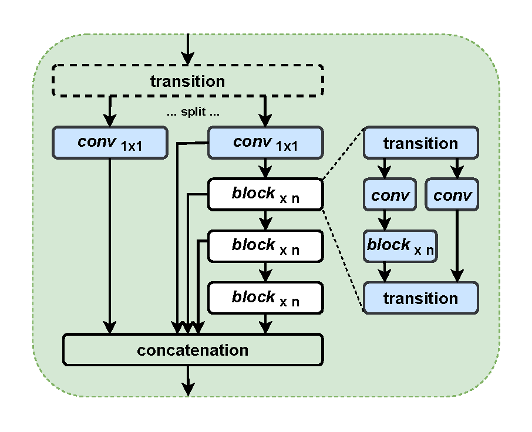
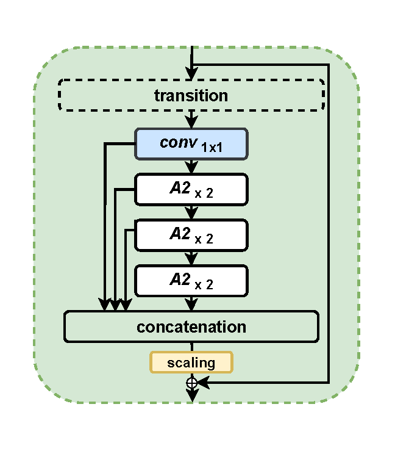
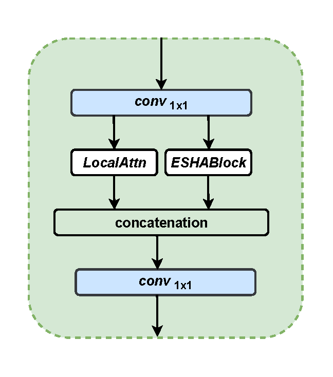
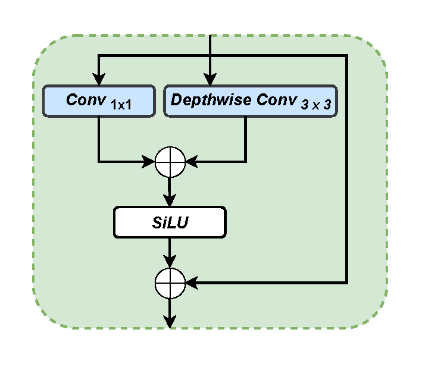
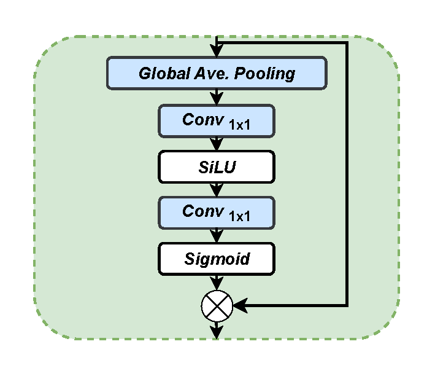

# Enhancing Fine-Grained Livestock Behavior Detection with Lightweight Parallel Attention in YOLOv12
**Preprint / Work in Progress**  

Official implementation of PLCA-Head (Parallel Local and Channel Attention Head) integrated into YOLOv12 for fine-grained cattle behavior recognition on CBVD-5 dataset.

## Abstract

Fine-grained livestock behavior recognition remains a key challenge in precision farming, as subtle posture variations and complex barn conditions often hinder the performance of standard YOLO-based detectors. To address these issues, we propose PLCA-Head, a lightweight parallel local and channel attention module integrated into YOLOv12. By combining dynamic local spatial recalibration with global channel-wise modulation in parallel paths, PLCA-Head effectively captures nuanced spatial and semantic features critical for distinguishing behaviors such as rumination. Evaluated on the CBVD-5 benchmark, our approach achieves 97.1% mAP@50, 72.4% mAP@50–95, 93.3% precision, and 94.4% rumination AP, outperforming both YOLOv12s and SlowFastNet across all major metrics. Compared to SlowFastNet, it reduces parameters by ~70%, GFLOPs by ~68.8%, and delivers 10× faster inference, while surpassing YOLOv12s in accuracy with 9.7% fewer convergence epochs and maintaining real-time performance. Source code and trained models: https://github.com/YifangGaoinPG/yolov12le.

**CBVD-5 Dataset Paper**  
Li, K., Fan, D., Wu, H. & Zhao, A. A new dataset for video-based cow behavior recognition. *Sci Rep* **14**, 18702 (2024). https://doi.org/10.1038/s41598-024-65953-x  
Dataset available at: https://www.kaggle.com/datasets/fandaoerji/cbvd-5cow-behavior-video-dataset

## Core Algorithm: PLCA-Head

PLCA-Head is a lightweight detection head with **parallel branches**:
- **LocalAttnBlock**: Dynamic local spatial attention via pointwise + depthwise conv.
- **ESHABlock**: Global channel attention via squeeze-and-hybrid (bottleneck 1×1 conv).

Input features are projected, processed in parallel, concatenated, and fused with 1×1 conv. Minimal overhead, big gains in fine-grained feature capture.

**Architecture Overview**:

### Detection Head Comparison (Figure 1 in the paper)

<div align="center">
  
  
  
</div>

*Figure 1: Comparison of three detection head refinement structures: (a) C3K2 featuring multi-path convolution, (b) R-ELAN utilizing residual layer aggregation, and (c) our proposed PLCA-Head employing parallel spatial and channel-wise attention.*

### PLCA-Head Submodules (Figure 2 in the paper)

<div align="center">
  
  
</div>

*Figure 2: Detailed structure of (a) LocalAttnBlock and (b) ESHABlock.*

### 3.3 Algorithmic Pipeline

Algorithm 1 outlines the inference process of the proposed PLCA-Head. The module refines the input feature map through parallel spatial and channel attention branches, followed by fusion and detection.

**Algorithm 1: PLCA-Head Inference Pipeline**

**Require:** Feature map $X$ from YOLOv12 neck  
**Ensure:** Final object predictions

1. $X_0 \leftarrow \text{Conv}_{1\times1}(X)$ &nbsp;&nbsp;&nbsp;&nbsp;&nbsp;&nbsp;&nbsp;&nbsp; ▷ Channel projection  
2. $X_L \leftarrow \text{LocalAttnBlock}(X_0)$ &nbsp;&nbsp;&nbsp;&nbsp;&nbsp;&nbsp;&nbsp;&nbsp; ▷ Spatial recalibration  
3. $X_C \leftarrow \text{ESHABlock}(X_0)$ &nbsp;&nbsp;&nbsp;&nbsp;&nbsp;&nbsp;&nbsp;&nbsp; ▷ Channel recalibration  
4. $X_{\text{fusion}} \leftarrow \text{Concat}(X_L, X_C)$ &nbsp;&nbsp;&nbsp;&nbsp;&nbsp;&nbsp;&nbsp;&nbsp; ▷ Merge branches  
5. $X_{\text{out}} \leftarrow \operatorname{Conv}_{1\times1}(X_{\text{fusion}})$   ▷ Final fusion
6. Predict detections using YOLOv12 Detect head  
   **return** Final object predictions

**Training Dynamics**:

  
*Figure 5: Training and validation metrics over 521 epochs.*

## Model Comparison on CBVD-5 Dataset

Per-behavior and overall performance of different YOLO variants, YOLOv12s, PLCA-Head-enhanced YOLOv12, and SlowFastNet. Results for YOLO-based models are reported as **mean ± standard deviation** over three independent runs (random seeds 0, 42, 1337).

| Model              | Behavior          | Precision          | Recall             | mAP@50             | mAP@50–95          |
|--------------------|-------------------|--------------------|--------------------|--------------------|--------------------|
| YOLOv8n           | Standing         | 0.934 ± 0.006     | 0.940 ± 0.010     | 0.973 ± 0.003     | 0.688 ± 0.020     |
|                   | Lying down       | 0.953 ± 0.011     | 0.945 ± 0.002     | 0.980 ± 0.005     | 0.658 ± 0.024     |
|                   | Foraging         | 0.874 ± 0.021     | 0.950 ± 0.019     | 0.962 ± 0.006     | 0.709 ± 0.017     |
|                   | Drinking water   | 0.837 ± 0.052     | 0.885 ± 0.026     | 0.933 ± 0.021     | 0.670 ± 0.028     |
|                   | Rumination       | 0.867 ± 0.011     | 0.852 ± 0.019     | 0.926 ± 0.014     | 0.617 ± 0.019     |
|                   | **Mean (5 behaviors)** | **0.893**     | **0.914**         | **0.955**         | **0.668**         |
| YOLOv9t           | Standing         | 0.946 ± 0.002     | 0.942 ± 0.004     | 0.977 ± 0.001     | 0.714 ± 0.012     |
|                   | Lying down       | 0.965 ± 0.003     | 0.949 ± 0.006     | 0.983 ± 0.003     | 0.688 ± 0.011     |
|                   | ... (similar for other behaviors) | ...           | ...               | ...               | ...               |
|                   | **Mean**         | **0.926**         | **0.922**         | **0.963**         | **0.695**         |
| YOLOv10n          | **Mean**         | **0.910**         | **0.919**         | **0.959**         | **0.705**         |
| YOLOv11n          | **Mean**         | **0.921**         | **0.937**         | **0.967**         | **0.705**         |
| YOLOv12n          | **Mean**         | **0.923**         | **0.927**         | **0.963**         | **0.695**         |
| YOLOv13n          | **Mean**         | **0.933**         | **0.937**         | **0.907**         | **0.712**         |
| SlowFastNet       | Overall          | —                 | —                 | 0.926             | —                 |
| YOLOv12s          | Overall          | 0.920             | **0.941**         | 0.965             | 0.721             |
| **Ours (PLCA-Head)** | Overall       | **0.933**         | 0.928             | **0.971**         | **0.724**         |

**Note**: Full per-behavior details for all models are in the paper (Table 3). Our PLCA-Head-enhanced YOLOv12 achieves the highest mAP@50 and mAP@50–95 overall.

**Key advantages of our model**:
- Higher mAP and precision than YOLOv12s baseline
- Much faster and lighter than SlowFastNet 
- Faster convergence 

For detailed training dynamics, convergence analysis, full curves (including F1, Precision, Recall, PR curves), confusion matrices, qualitative results, and additional visualizations (labels, correlagram, etc.), please refer to the full paper (Sections 4–5 and corresponding figures).

More results and analyses are available in the paper.

## Quick Start 🚀


### 1. Install Dependencies

For **our PLCA-Head enhanced YOLOv12** (recommended for reproduction):

```bash
pip install -q git+https://github.com/YifangGaoinPG/yolov12le.git roboflow supervision flash-attn
```
For **baseline YOLOv8-12 / Ultralytics versions**:

```bash
pip install -q git+https://github.com/sunsmarterjie/yolov12.git roboflow supervision flash-attn
```

For **YOLOv13 (supports Flash Attention acceleration)**:

```bash
wget https://github.com/Dao-AILab/flash-attention/releases/download/v2.7.3/flash_attn-2.7.3+cu11torch2.2cxx11abiFALSE-cp311-cp311-linux_x86_64.whl
conda create -n yolov13 python=3.11
conda activate yolov13
pip install -r requirements.txt
pip install -e .
```
### 2. Dataset
Use the following code:
```python

import pillow_heif

def mock_register_avif_opener(*args, **kwargs):
    pass

pillow_heif.register_avif_opener = mock_register_avif_opener

from roboflow import Roboflow

ROBOFLOW_API_KEY = 'YOUR_ROBOFLOW_API_KEY_HERE'  # ← Replace with your key

rf = Roboflow(api_key=ROBOFLOW_API_KEY)
project = rf.workspace("shyam-hdmec").project("cbvd")
version = project.version(1)
dataset = version.download("yolov12")

# Optional: clean up data.yaml (common Roboflow path issue)
import os
yaml_path = os.path.join(dataset.location, "data.yaml")
with open(yaml_path, "r") as f:
    lines = f.readlines()
with open(yaml_path, "w") as f:
    f.writelines(lines[:-4])
```

### Training
```python
from ultralytics import YOLO

# Examples:
# - Our PLCA-Head: YOLO("yolov12s.yaml")  # already modified in this repo
# - Baseline YOLOv12s: YOLO("yolov12s.pt") or YOLO("yolov12s.yaml")
# - YOLOv8n: YOLO("yolov8n.yaml")
# - YOLOv13n: YOLO("yolov13n.yaml")  # if using YOLOv13 repo

model = YOLO("path_to_yolo_yaml_file")  # e.g. "yolov12s.yaml"

results = model.train(
    data=f"{dataset.location}/data.yaml",
    epochs=600,
    patience=50,
    batch=32,               # adjust for your GPU
    imgsz=640,
    optimizer="SGD",
    lr0=0.01,
    momentum=0.937,
    weight_decay=0.0005,
    cos_lr=True,
    amp=True,
    workers=8,
    name="experiment_name",
    pretrained=True,
    # Additional augments from paper (optional)
    scale=0.5,
    mosaic=1.0,
    mixup=0.0,
    copy_paste=0.1
)
```
### Validation
```python
from ultralytics import YOLO

# Load trained model
model = YOLO("runs/detect/yolov12le_train/weights/best.pt")

# Validate
metrics = model.val(data=f"{dataset.location}/data.yaml")
```

### Citation
@article{gao2026enhancing,
  title={Enhancing Fine-Grained Livestock Behavior Detection with Lightweight Parallel Attention in YOLOv12},
  author={Gao, Yifang and Luo, Wei and Zhang, Shunshun and Ahmad, Nur Syazreen and Wang, Xiaojun and Goh, Patrick},
  journal={The Visual Computer},
  year={2026},
  publisher={Springer}
  % doi = {insert DOI when available}
}

### Related Projects 🔗

- Based on [Ultralytics](https://github.com/ultralytics/ultralytics)
- CBVD-5 Dataset paper: [https://www.nature.com/articles/s41598-024-52266-1](https://www.nature.com/articles/s41598-024-65953-x)

Thank you for your interest in our work!  
Any questions → please open an issue on GitHub.
